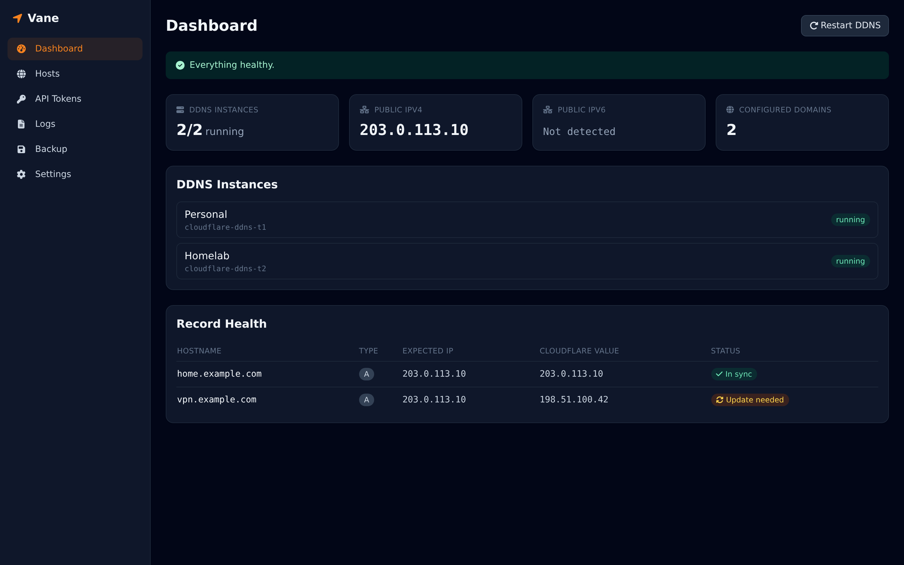
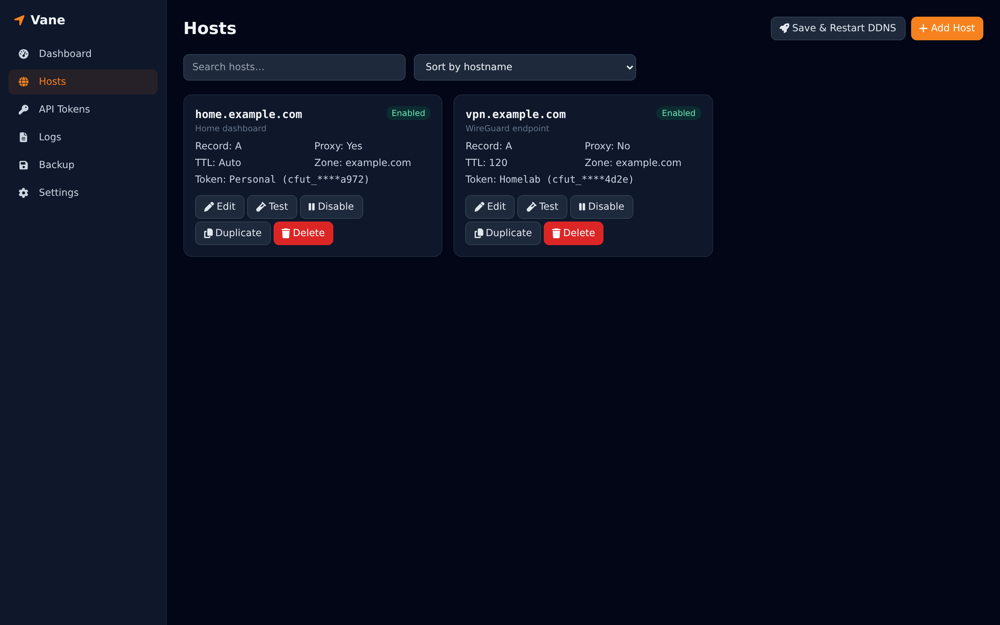
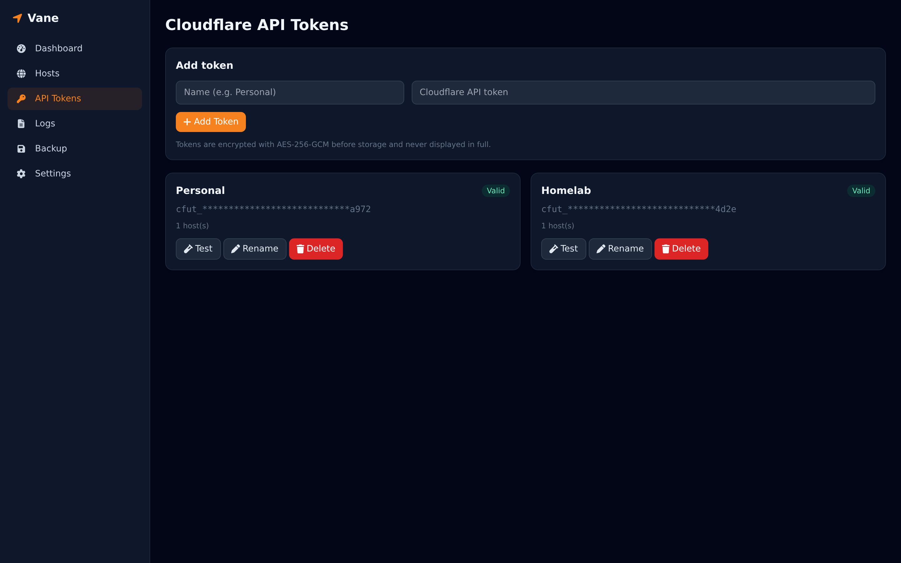
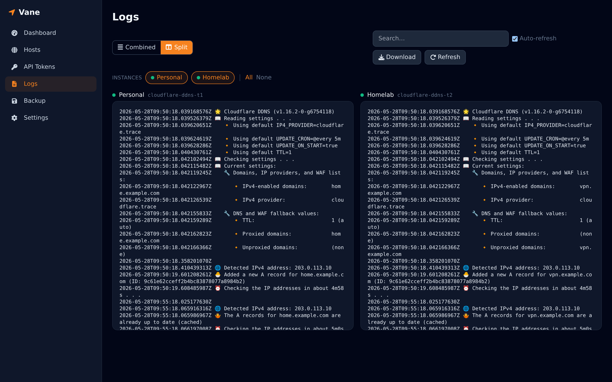
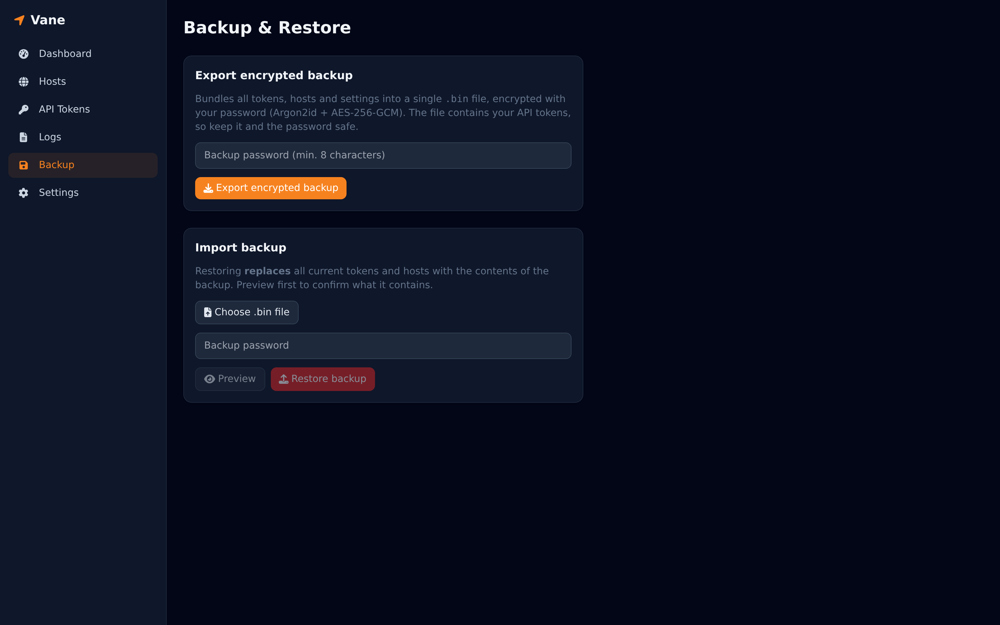
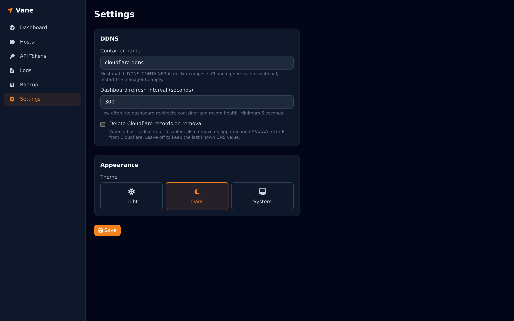

# Vane

[](https://github.com/Locko2901/vane/actions/workflows/ci.yml)
[](https://github.com/Locko2901/vane/releases/latest)
[](LICENSE)
[](https://github.com/Locko2901/vane/pkgs/container/vane)

**Vane** is a lightweight, self-hosted web UI for dynamic DNS on Cloudflare - a
friendly control panel for
[`favonia/cloudflare-ddns`](https://github.com/favonia/cloudflare-ddns) containers.
It replaces manual editing of environment variables / config files with an
intuitive dashboard, encrypted multi-token storage, live Cloudflare
validation, and one-click apply-and-restart of the DDNS container(s).

Vane never modifies the DDNS image. It communicates with Docker
**only** through:

- the Docker socket (create/recreate one favonia container per API token, read
  status/logs), and
- a generated config record written to the shared config volume for reference.



---

## Contents

- [Features](#features)
- [Roadmap](#roadmap)
- [Architecture](#architecture)
- [Requirements](#requirements)
- [Quick start](#quick-start)
- [Environment variables](#environment-variables)
- [How configuration is applied](#how-configuration-is-applied)
- [Migrating an existing setup](#migrating-an-existing-setup)
- [Backup and restore](#backup-and-restore)
- [Development](#development)
- [Screenshots](#screenshots)
- [Security notes](#security-notes)
- [Project structure](#project-structure)
- [Contributing](#contributing)
- [License](#license)

---

## Features

Vane is a control layer on top of
[`favonia/cloudflare-ddns`](https://github.com/favonia/cloudflare-ddns): favonia
does the actual DNS updating, and Vane gives you a UI to configure and operate
it. The list below separates what you can drive today from what Vane adds on top
- see the [Roadmap](#roadmap) for favonia capabilities not yet surfaced.

### Supported Cloudflare DDNS capabilities

These favonia features are configurable straight from the Vane UI:

- **Multiple domains per token** - list any FQDNs across different zones; Vane
  resolves the zone for each via the Cloudflare API, so no zone IDs are needed
  (favonia `DOMAINS`).
- **IPv4 / IPv6 / both** - per-host record type (A / AAAA / Both) mapped to
  favonia `IP4_DOMAINS` / `IP6_DOMAINS`; unused IP families are switched off
  automatically (`IP4_PROVIDER` / `IP6_PROVIDER` = `none`).
- **Cloudflare proxy** - per-host proxy (orange-cloud) toggle; mixed on/off
  selections are compiled into favonia `PROXIED=is(...)` expressions.
- **TTL** - automatic (Cloudflare `1`) or a custom TTL per token (favonia `TTL`).
- **Per-token isolation** - one favonia container per Cloudflare API token, all
  syncing simultaneously, so a leaked or over-scoped token can only touch its
  own zones.
- **Live Cloudflare validation** - token permissions and zone / record lookups
  are checked against the Cloudflare API before you save.

### What Vane adds

The management layer on top of favonia:

- **Dashboard** - per-token instance status (running/stopped/restarting), public
  IPv4/IPv6, configured domain count, per-record health (expected vs. Cloudflare
  value), and health banners (auth failed, zone not found, instance offline, etc.).
- **Hosts** - card view of every DDNS host with Edit / Delete / Enable-Disable /
  Test / Duplicate actions.
- **Add Host Wizard** - token picker, zone, hostname (`@`/`sub`), record type
  (A / AAAA / Both), proxy toggle, TTL (auto/custom), description, and **live
  validation** against the Cloudflare API before saving.
- **Multiple API tokens** - store unlimited Cloudflare API tokens (Personal,
  Work, Homelab...). Each host picks which token to use, and the manager runs a
  **separate favonia container per token** so every token syncs simultaneously.
- **Token management** - add / rename / delete / test permissions. Tokens are
  encrypted at rest with AES-256-GCM and never displayed in plaintext.
- **Config generation** - produces favonia-compatible environment variables; the
  UI is the source of truth, no manual YAML editing.
- **Automatic import** - on first launch, existing configuration is imported by
  inspecting the running DDNS container's environment.
- **Logs** - live `docker logs` per favonia instance (or all combined) with
  auto-refresh, search and download.
- **Restart management** - Save & Restart recreates the DDNS container(s) so new
  env takes effect; errors are surfaced as toasts.
- **Backup** - password-encrypted export/import of tokens, hosts and settings as
  a single `.bin` file (Argon2id + AES-256-GCM). See
  [Backup and restore](#backup-and-restore).
- **Settings** - container name, dashboard refresh interval, light/dark theme,
  and optional deletion of app-managed Cloudflare records when a host is
  removed or disabled.

---

## Roadmap

favonia supports more than Vane currently exposes. These are capabilities I'd
like to surface through the UI - listed for transparency, with no committed
timeline or ordering. Feedback and contributions are welcome; open an issue to
weigh in.

- **WAF lists** - manage Cloudflare WAF / Rules IP lists (favonia `WAF_LISTS`),
  not just DNS records.
- **Notifications** - Healthchecks, Uptime Kuma, and shoutrrr targets
  (`HEALTHCHECKS`, `UPTIMEKUMA`, `SHOUTRRR`) so you're alerted on update
  failures.
- **Selectable IP providers** - today Vane relies on favonia's default
  `cloudflare.trace`; expose alternatives like `cloudflare.doh`, `local`, and
  `url:...`.
- **Custom update schedule** - configurable `UPDATE_CRON` (currently favonia's
  default of every 5 minutes).
- **Wildcard domains** - first-class UI support and validation for
  `*.example.org`.
- **Internationalized domain names** - explicit UI handling for IDNs
  (e.g. `日本｡co｡jp`).
- **Advanced IPv6 host IDs** - per-domain `hostid6` (fixed suffix or MAC-derived
  EUI-64).
- **Detection filters** - `IP4_DETECTION_FILTER` / `IP6_DETECTION_FILTER` to
  accept only certain address ranges.
- **Record comments & multi-instance sharing** - `RECORD_COMMENT` and
  comment-regex scoping for sharing zones safely across instances.
- **Tuning knobs** - `CACHE_EXPIRATION`, `DETECTION_TIMEOUT`, `UPDATE_TIMEOUT`,
  and `TZ`.
- **Tokens via Docker secrets** - read API tokens from `*_FILE` / mounted
  secrets instead of Vane's encrypted store.

---

## Architecture

```
Browser
   │
   ▼
Vane (Express + React)
   ├── edits config (writes ./cloudflare-ddns/ddns.env)
   ├── stores encrypted secrets (SQLite via Prisma, on /data)
   ├── validates entries (Cloudflare API)
   └── Docker API (/var/run/docker.sock)
            │
            ├──► favonia instance for token A  (cloudflare-ddns-t1)
            ├──► favonia instance for token B  (cloudflare-ddns-t2)
            └──► ... one container per Cloudflare API token
```

The compose-defined `cloudflare-ddns` container is used only as a **template**
(image, restart policy, DNS servers, network). The manager keeps it stopped and
spins up one `cloudflare-ddns-t<tokenId>` container for each token that has
enabled hosts.


### Tech stack

| Layer     | Tech                                  |
| --------- | ------------------------------------- |
| Backend   | Node.js, Express, TypeScript          |
| Frontend  | React, Vite, TailwindCSS              |
| Database  | SQLite                                |
| ORM       | Prisma                                |
| Container | Docker (multi-stage build)            |

---

## Requirements

- **Docker Engine** 20.10 or newer.
- **Docker Compose v2** (the `docker compose` subcommand). The launcher and
  install scripts call `docker compose`, not the legacy `docker-compose` binary.
- Access to the host **Docker socket** (`/var/run/docker.sock`) - the manager
  creates and recreates the favonia containers through it.
- A **Linux host** is assumed (Docker Desktop on macOS/Windows works, but socket
  paths and networking may differ).
- Prebuilt images are published for `linux/amd64` and `linux/arm64`; other
  architectures need a [build from source](#build-from-source-instead).

---

## Quick start

Pick the path that matches your setup. Both use the prebuilt multi-arch image
from GHCR (`linux/amd64`, `linux/arm64`) - nothing to build.

> **Note:** `scripts/install.sh` and `run-docker.sh` are pure convenience
> wrappers to get you started - they just fetch a couple of files and call
> `docker compose` for you. If you already know your way around Docker, copying
> the two compose services together by hand (option A below) is often the
> simplest path; you don't need either script.

### A. Already running favonia/cloudflare-ddns

Most people land here. Just drop the manager service into your existing
`docker-compose.yml` alongside your favonia service:

```yaml
  vane:
    image: ghcr.io/locko2901/vane:latest
    container_name: vane
    restart: unless-stopped
    ports:
      - "8088:3000"
    environment:
      - DDNS_CONTAINER=cloudflare-ddns
    volumes:
      - ./cloudflare-ddns:/ddns-config          # config record volume (manager writes ddns.env here)
      - ./vane-data:/data               # SQLite DB + secrets
      - /var/run/docker.sock:/var/run/docker.sock
    depends_on:
      - cloudflare-ddns
```

Then pull and start it:

```bash
docker compose up -d vane
```

On first launch the manager auto-imports your existing favonia config - see
[Migrating an existing setup](#migrating-an-existing-setup).

### B. Fresh install (no existing DDNS stack)

One-liner: the installer downloads just the launcher and the compose file,
pins them to the latest release, and prints the exact command to start:

```bash
curl -fsSL https://raw.githubusercontent.com/Locko2901/vane/main/scripts/install.sh | bash
cd vane
./run-docker.sh --pull
```

The launcher checks Docker, creates the config/data directories, pulls the
image, starts the stack, and waits until the health check passes. When it
finishes it prints the dashboard URL.

<details>
<summary>Pick a target directory, pin a release, or track dev</summary>

Pass a target directory as an argument:

```bash
curl -fsSL https://raw.githubusercontent.com/Locko2901/vane/main/scripts/install.sh | bash -s -- my-ddns
```

Pin a specific tag (launcher **and** image), or track the bleeding edge, with
`DDNS_REF`:

```bash
# Pin to a specific release
curl -fsSL https://raw.githubusercontent.com/Locko2901/vane/main/scripts/install.sh \
    | DDNS_REF=v1.2.0 bash
cd vane
./run-docker.sh --pull=v1.2.0

# Track the latest main build instead
curl -fsSL https://raw.githubusercontent.com/Locko2901/vane/main/scripts/install.sh \
    | DDNS_REF=main bash
cd vane
./run-docker.sh --pull=dev
```

</details>

> Prefer to inspect the script first? Download `scripts/install.sh` and read it
> before running, or clone the repo and [build from source](#build-from-source-instead).

---

Open <http://localhost:8088> and you're in - the UI has no login screen (see
[Security notes](#security-notes) before exposing it).

> **Tags:** `latest` (newest release), `1`, `1.2`, `1.2.3` (pinned versions),
> and `dev` (latest `main`). Images are multi-arch (`linux/amd64`, `linux/arm64`).

### The `run-docker.sh` launcher

The launcher wraps the common Docker Compose operations:

```bash
./run-docker.sh --pull            # pull the latest release and (re)start
./run-docker.sh --pull=v1.2.3     # pin a specific release tag
./run-docker.sh --pull=dev        # track the latest main build
./run-docker.sh --logs            # follow container logs
./run-docker.sh --status          # show stack status
./run-docker.sh --stop            # stop the stack
./run-docker.sh --prune           # clean up old/dangling images
./run-docker.sh --help            # full option list
```

Handy environment variables: `DDNS_PORT` (host port, default `8088`),
`DDNS_HEALTH_TIMEOUT` (health-check wait, default `30`s), and
`VANE_IMAGE` (override the full image ref).

### Build from source instead

Prefer to build the image yourself? Clone the repo and let the launcher build
the local image (or use Compose directly):

```bash
git clone https://github.com/Locko2901/vane.git
cd vane
./run-docker.sh                   # builds ./vane, then starts
# or: ./run-docker.sh --rebuild   # force a fresh rebuild
```

Want to build a specific release instead of the latest `main`? Check out the
tag first, then build:

```bash
git clone https://github.com/Locko2901/vane.git
cd vane
git checkout v1.2.0               # pin to a release tag
./run-docker.sh --rebuild         # build that tag from source
```

Equivalent plain Compose:

```yaml
  vane:
    build: ./vane
    # ...same container_name, ports, environment, volumes, depends_on as above
```

```bash
docker compose up -d --build vane
```

---

## Environment variables

| Variable           | Default            | Description                                            |
| ------------------ | ------------------ | ------------------------------------------------------ |
| `DDNS_CONTAINER`   | `cloudflare-ddns`  | Template container name; per-token instances are named `<name>-t<id>`. |
| `PORT`             | `3000`             | Internal listen port.                                  |
| `DATA_DIR`         | `/data`            | SQLite DB + encryption key location.                   |
| `DDNS_CONFIG_DIR`  | `/ddns-config`     | Where the generated `ddns.env` is written.             |
| `DOCKER_SOCKET`    | `/var/run/docker.sock` | Docker API socket path.                            |

---

## How configuration is applied

1. You edit hosts/tokens in the UI (stored encrypted in SQLite).
2. **Save & Restart** groups enabled hosts by their Cloudflare API token and
   generates favonia environment variables per group (`CLOUDFLARE_API_TOKEN`,
   `DOMAINS`/`IP4_DOMAINS`/`IP6_DOMAINS`, `PROXIED`, `TTL`), writing a combined
   record to `./cloudflare-ddns/ddns.env`.
3. The manager uses the Docker API to **recreate one favonia container per
   token** (`cloudflare-ddns-t<tokenId>`), derived from the compose-defined
   `cloudflare-ddns` template (image, restart policy, DNS, network). Containers
   for tokens that no longer have enabled hosts are removed automatically.

> **Multiple API tokens:** each API token gets its own favonia
> container, so several tokens sync at the same time. favonia's one-token
> limit is respected per container, not globally. The base `cloudflare-ddns`
> container defined in compose stays stopped and serves only as a template - you
> don't need to add extra services to `docker-compose.yml`.

> **Note:** the manager needs access to the Docker socket to create these
> containers. They are labelled `vane.managed=true` and are created on
> the same network as the template container.

### Performance and resource use

Running one favonia container per token is a deliberate **convenience and
security** feature: each API token stays isolated in its own container, so
there's no "one API key to rule them all" - a leaked or over-scoped token
can only touch the zones it was issued for, and you can add/remove tokens
independently without touching the others.

The trade-off is that the cost scales with the number of tokens, not the number
of hosts. Things to keep in mind:

- **Idle footprint is small.** favonia is a tiny Go binary; each instance uses a
  few MB of RAM and negligible CPU between update cycles. A handful of tokens is
  unnoticeable on typical hardware; dozens of tokens means dozens of idle
  containers, so account for the per-container base overhead if you go large.
- **Work is duplicated per instance, not shared.** Every container runs its own
  `UPDATE_CRON` schedule and **independently detects your public IP** each cycle
  (default `cloudflare.trace`). With _N_ tokens you get _N_× the IP-detection
  lookups and _N_ separate schedulers, even though they all resolve the same
  address.
- **Cloudflare API calls add up.** Each instance polls/updates its own records on
  every cycle. This is normally well within Cloudflare's rate limits (1200
  requests / 5 min), but many tokens with many hosts and a short `UPDATE_CRON`
  can push request volume up. Prefer a sane interval (the default is every 5
  minutes).
- **Apply/restart is O(tokens).** **Save & Restart** recreates every managed
  container, so a large number of instances makes each apply take longer.
- **Logs are per instance.** Each container keeps its own `docker logs`; the
  combined Logs view fetches them in parallel, so log volume grows with the
  instance count.

If you have several tokens but don't need them isolated, you can reduce
container count by consolidating hosts onto fewer tokens - a single token
handles unlimited domains within its zones.


---

## Migrating an existing setup

Short answer: **yes, in the common case you can drop the manager on top of an
existing `favonia/cloudflare-ddns` container and it will pick up your config
automatically** - but there are a few caveats.

On first launch (empty database), the manager inspects the environment of the
container named by `DDNS_CONTAINER` and imports it:

- `CLOUDFLARE_API_TOKEN` → an encrypted token called **"Imported"**.
- `DOMAINS` / `IP4_DOMAINS` / `IP6_DOMAINS` → hosts (`BOTH` / `A` / `AAAA`).
- `PROXIED` (boolean) and `TTL` → per-host defaults.

### What you need for auto-import to work

1. The existing container's name must match `DDNS_CONTAINER` (default
   `cloudflare-ddns`). Set the env var if yours is named differently.
2. Your favonia config must be supplied via **environment variables** (the
   layout in favonia's Docker Compose docs), not a mounted `config.yaml`.
3. The token must be a literal `CLOUDFLARE_API_TOKEN` env value.
4. Add the manager with the Docker socket and a `depends_on: [cloudflare-ddns]`
   so the template container exists.

After import, open **Hosts**, review the imported entries, then click
**Save & Restart**. At that point the manager **stops your original
`cloudflare-ddns` container** and starts one `cloudflare-ddns-t<id>` container
per token. This is expected - the original service stays defined in compose but
is kept stopped as a template.

### When you must migrate manually

Auto-import is skipped (or partial) in these cases - recreate the entries by
hand in the UI, then **Save & Restart**:

- **Config-file setup** (favonia `config.yaml` / non-env config): domains aren't
  in the container env, so nothing is imported. Add tokens and hosts manually.
- **Token via file/secret** (e.g. `CLOUDFLARE_API_TOKEN_FILE`): the literal
  token isn't in the env, so import stops. Add the token under **Tokens**.
- **Per-domain proxy expressions** (`PROXIED=is(a.example.com)`): import treats
  `PROXIED` as a single boolean, so re-check the proxy toggle per host.
- **Container named something other than `cloudflare-ddns`** without setting
  `DDNS_CONTAINER`: nothing is found to import.

Nothing is destructive: the manager never edits your DDNS image or Cloudflare
records unless you enable the optional "delete records on removal" setting.

---

## Backup and restore

The **Backup** page exports and imports your entire configuration - tokens,
hosts, and settings - as a single **password-encrypted** `.bin` file. Useful for
migrating to a new server, cloning a setup, or keeping offline backups.

### Usage

- **Export**: enter a password (min. 8 characters) and click **Export encrypted
  backup**. You get back a `vane-backup-<date>.bin` file.
- **Import**: choose a `.bin` file, enter its password, click **Preview** to
  verify the contents, then **Restore backup**.

> **Import replaces everything.** Existing tokens and hosts are **deleted** and
> recreated from the file (settings are merged). Export first if you want a
> rollback point, then click **Save & Restart** afterwards to apply.

The backup contains your Cloudflare API tokens. Store the file securely and use
a strong password - anyone with both can recover the tokens.

### How the encryption works

Skip this unless you want to audit the format.

```
Binary format (v1):
  [4B magic "VANE"][1B version][1B KDF id][4B mem_cost][4B iterations][4B parallelism]
  [16B salt][12B nonce][ciphertext || 16B GCM auth tag]
```

- A 256-bit key is derived from your password with **Argon2id** (128 MiB memory,
  3 iterations, 4 threads) using a random 16-byte salt.
- The JSON bundle is encrypted with **AES-256-GCM** using a random 12-byte
  nonce; the full 18-byte header is authenticated as the GCM **AAD**, so
  tampering with the version byte or KDF parameters (e.g. lowering the memory
  cost) fails decryption.
- The password is never stored - it exists only in memory during key
  derivation. Because the key comes from your password (not the instance's
  `secret.key`), a backup restores on any fresh install; imported tokens are
  re-encrypted at rest with the target instance's key.

---

## Development

Backend:

```bash
cd vane/backend
npm install
npx prisma generate --schema ../prisma/schema.prisma
DATABASE_URL="file:../../vane-data/dev.db" npx prisma db push --schema ../prisma/schema.prisma
npm run dev
```

Frontend (proxies `/api` to `:3000`):

```bash
cd vane/frontend
npm install
npm run dev
```

---

## Screenshots

| Hosts | API Tokens |
| --- | --- |
|  |  |

| Logs | Backup |
| --- | --- |
|  |  |

| Settings |
| --- |
|  |

UI screenshots are generated deterministically with Playwright. The script
(`tests/screenshots/`) serves the built frontend, answers every `/api` call
from fixtures, and freezes the clock, so re-runs are byte-identical and never
touch real Cloudflare or Docker:

```bash
./scripts/regen-screenshots.sh            # all, into ./screenshots
./scripts/regen-screenshots.sh --only settings
```

---

## Security notes

- **No built-in authentication.** The UI has no login and assumes a trusted
  network. Do **not** expose it directly to the internet - keep it on your LAN
  and/or put it behind a reverse proxy or VPN that handles auth (and TLS).
- API tokens are encrypted with AES-256-GCM; the master key lives only on the
  `/data` volume (`secret.key`, mode `0600`).
- Tokens are never returned to the browser in plaintext (only masked).
- **Backups are password-encrypted** (Argon2id + AES-256-GCM); the `.bin` file
  still grants access to your tokens to anyone who has both it and the password,
  so store both securely (see [Backup and restore](#backup-and-restore)).
- Input is validated server-side with Zod.
- No shell execution from user input - Docker is controlled via the API.
- Mounting the Docker socket grants broad host privileges; restrict access to
  the manager accordingly.

---

## Project structure

```
vane/
  backend/        Express + TypeScript API
  frontend/       React + Vite + Tailwind SPA
  prisma/         Prisma schema (SQLite)
  docker/         entrypoint.sh
  Dockerfile      Multi-stage production build
docker-compose.yml
cloudflare-ddns/  Shared config volume (favonia reads ddns.env)
```

---

## Contributing

Contributions are welcome. See [CONTRIBUTING.md](CONTRIBUTING.md) for the full
guide (development setup, pull-request workflow, and the Conventional Commits
format). A few notes to get started:

- Open an issue before large changes so we can align on direction.
- Keep the backend (`vane/backend`) and frontend
  (`vane/frontend`) lint-clean; CI runs ESLint and TypeScript builds on
  every push and pull request.
- Run [`./precommit.sh`](precommit.sh) before pushing to catch lint/type errors
  locally.
- Screenshots are generated deterministically - regenerate them with
  `./scripts/regen-screenshots.sh` when UI changes affect them.

By participating, you agree to abide by our
[Code of Conduct](CODE_OF_CONDUCT.md). To report a vulnerability, see the
[Security Policy](SECURITY.md).

---

## License

Released under the [MIT License](LICENSE).
